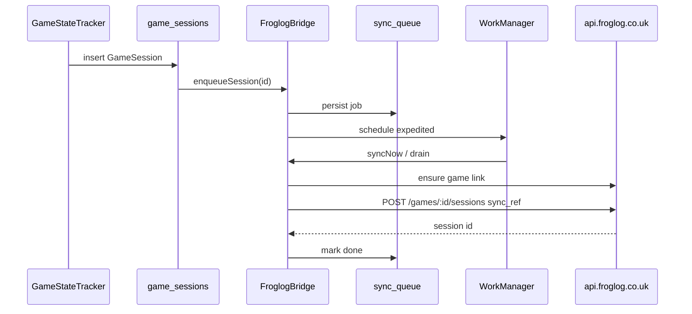

# Froglog × Cocoon — integration plan

Single **Cocoon Shell** APK with a **Froglog Pod** and a shared **`froglog-core`** module. Playtime from the existing session pipeline syncs to [Froglog API](https://wiki.froglog.co.uk/Api/Documentation); Picnic and other Pods integrate later via `FroglogBridge`.

See also: [API_CONTRACT.md](./API_CONTRACT.md) · [FROGLOG_POD.md](./FROGLOG_POD.md)

## Goals

- **One app** — same `applicationId` as Cocoon; Froglog is built into this fork, not a separate product.
- **Froglog Pod** — account, sync control, library linking, stats (see [FROGLOG_POD.md](./FROGLOG_POD.md)).
- **Automatic session push** — Cocoon `GameSession` → `POST /api/games/:id/sessions` with `sync_ref` for idempotency.
- **Cross-Pod API** — `FroglogBridge` for Log, Picnic, and future Pods.
- **Offline-first** — local queue + `WorkManager`; respect Wi‑Fi and rate limits.

## Non-goals (v1)

- Replacing Cocoon local `game_sessions` (device remains source of truth for tracking).
- Full bidirectional merge (Froglog edits on web are not written back to Cocoon in v1).
- Picnic screenshot upload until Froglog exposes an API (bridge method reserved).

---

## Cocoon playtime pipeline (unchanged)

| Layer | Responsibility |
|--------|----------------|
| **GameStateTracker** | Session lifecycle from emulator focus |
| **Room `game_sessions`** | Persisted sessions |
| **Log Pod** | Local stats UI only |
| **Froglog** | Async export via `froglog-core`, not inside Log Pod UI logic |

**Hook:** after `GameSessionDao.insert` succeeds → `FroglogBridge.enqueueSession(sessionId)`.

---

## Repository layout

```text
android/                          # Cocoon Shell (imported from release)
  app/                            # Depends on :froglog-core; registers Froglog Pod
  froglog-core/                   # API, auth, queue, bridge, Pod ViewModels
docs/froglog/
scripts/import-cocoon-source-from-release.sh
```

Rename from earlier `froglog-sync` stub → **`froglog-core`** (sync + API + shared types).

### `froglog-core` modules (packages)

| Package | Contents |
|---------|----------|
| `...froglog.api` | Ktor/Retrofit: auth, games, sessions, search, stats |
| `...froglog.auth` | JWT storage (EncryptedSharedPreferences), login/register |
| `...froglog.data` | Room: `froglog_game_links`, `froglog_sync_queue`, DAOs |
| `...froglog.sync` | Mapper, workers, rate-limit aware drain |
| `...froglog.bridge` | `FroglogBridge` implementation |
| `...froglog.pod` | Compose UI used by `FroglogPodActivity` |

---

## Sync flow



### Triggers

| Trigger | Action |
|---------|--------|
| Session completed | Enqueue + expedited worker |
| App start | Drain queue; token check |
| Periodic | Every 6h (Wi‑Fi, configurable) |
| Froglog Pod | Manual “Sync now”; login |
| First login | Backfill unsynced sessions (batched, rate-limit aware) |

### Idempotency

`sync_ref = "cocoon:session:{GameSession.id}"` on every create (see [API_CONTRACT.md](./API_CONTRACT.md)).

Store Froglog `session.id` in `froglog_sync_queue` or a `froglog_session_map` table for updates.

---

## Game matching

1. Local link table hit → use `froglog_game_id`.
2. Else fuzzy match against cached `GET /api/games` (title + platform).
3. Else `GET /api/search?q={title}` — auto-pick or prompt in Froglog Pod.
4. Else `POST /api/games` (watch **60/hour** cap during backfill).

Live-service games: user moves title on Froglog → update `froglog_kind` on next `GET /api/games` / live-service list sync.

---

## Log Pod vs Froglog Pod

| | Log Pod | Froglog Pod |
|---|---------|-------------|
| Data | Local only | Froglog account + API |
| Login | No | Yes |
| Session upload | Via bridge (automatic) | Manual sync + settings |
| Future | Show sync chip | Full Froglog UX |

---

## Picnic (phase 2+)

- Picnic calls `FroglogBridge.enqueueScreenshot(id)`.
- Until API exists: document in Pod settings; optional `notes` on session with file path is **not** a substitute — wait for media endpoint.

---

## Security

- JWT in encrypted storage; never log tokens.
- Production base URL only in release; debug override gated.
- Clear queue + links on sign out (keep Cocoon local data).

---

## Implementation phases

### Phase 0 — Repo prep ✅

Docs, import script, upstream remote.

### Phase 1 — Import Cocoon sources

Run `scripts/import-cocoon-source-from-release.sh` (downloads `https://github.com/inssekt/CocoonFE/archive/refs/tags/<tag>.zip`).

### Phase 2 — `froglog-core` + API client

Implement auth, games, sessions, search per [API_CONTRACT.md](./API_CONTRACT.md). Unit tests for mapper and `sync_ref`.

### Phase 3 — Bridge + session hook

`GameSession` insert → queue → worker. Game link table.

### Phase 4 — Froglog Pod

Activity, Pod registration, login, sync UI, stats.

### Phase 5 — Log Pod polish

Sync status chip; tap → Froglog Pod.

### Phase 6 — Picnic

When API available, implement screenshot path through bridge.

---

## Upstream

- Platforms: `scripts/sync-upstream-platforms.sh` from `inssekt/CocoonFE`.
- Android: [tag archive zip](https://github.com/inssekt/CocoonFE/archive/refs/tags/beta-3.0.zip) via `scripts/import-cocoon-source-from-release.sh` (plus optional release asset); fork code in `froglog-core` + thin `app` wiring.

## Decisions (locked)

| Topic | Decision |
|-------|----------|
| App count | **One** Cocoon APK |
| Froglog UX shell | **Dedicated Froglog Pod** |
| Cross-pod integration | **`FroglogBridge`** |
| Session API | `POST /api/games/:id/sessions` + `sync_ref` |
| Auth | JWT via login/register |

## Open (minor)

- Auto vs manual confirm when search returns multiple RAWG hits.
- Default `is_public` for new sessions.
- Whether to call `PUT /api/games/:id` to bump `hours_played` or rely on session aggregation server-side.
